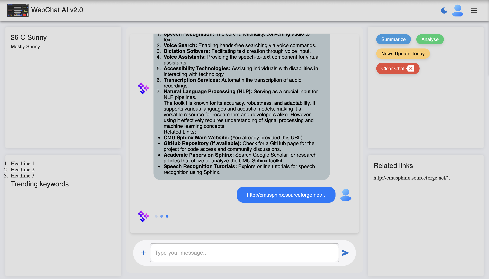

# WebChat - AI Chatbot

WebChat is an AI-powered chatbot application that allows users to interact with various language models. This project utilizes React for the frontend and a Python backend to process user queries.

## Table of Contents

- [Features](#features)
- [Installation](#installation)
- [Usage](#usage)
- [Contributing](#contributing)
- [License](#license)

## Features

- Interactive chat interface
- Supports multiple language models
- Fetches web data for enhanced responses
- Responsive design for mobile and desktop

## Installation

### Prerequisites

- Node.js (v14 or later)
- Python (v3.9 or later)
- pip (Python package manager)
- Ollama (v1.9.0 or later)
- LLama3.2

### Frontend Setup

1. Navigate to the frontend directory:

   ```bash
   cd frontend
   ```

2. Install the dependencies:

   ```bash
   npm install
   ```

3. Start the development server:

   ```bash
   npm start
   ```

### Backend Setup

1. Navigate to the backend directory:

   ```bash
   cd backend
   ```

2. Install the required Python packages:

   ```bash
   pip install -r requirements.txt
   ```

3. Start the backend server:

   ```bash
   python3.9 app.py
   ```

## Usage

1. Open your browser and go to `http://localhost:3000` to access the chat interface.
2. Type your message in the input field and press Enter or click the Send button.
3. The chatbot will respond based on the selected language model.

## Contributing

Contributions are welcome! Please follow these steps to contribute:

1. Fork the repository.
2. Create a new branch for your feature or bug fix.
3. Make your changes and commit them.
4. Push your branch to your forked repository.
5. Create a pull request.

## License

This project is licensed under the MIT License. See the [LICENSE](LICENSE) file for details.